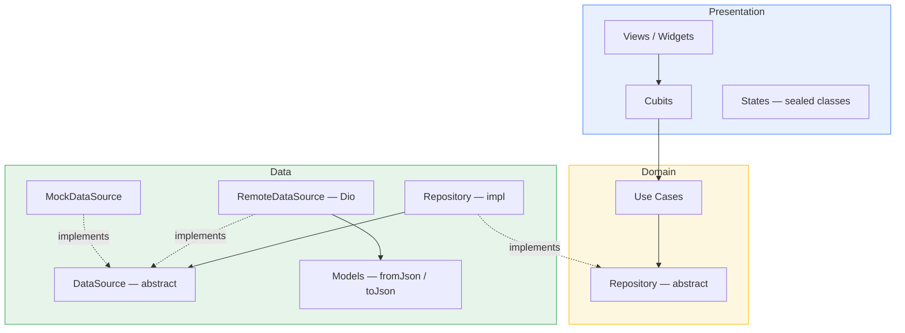
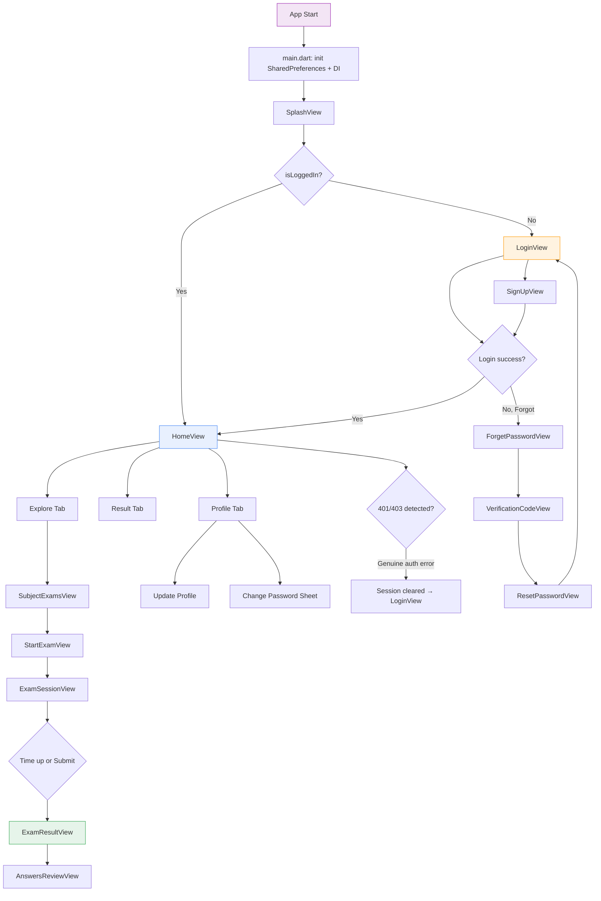

# Exam App

> **Elevate Online Exams** — A Flutter mobile application for browsing subjects, taking timed multiple-choice exams, reviewing results, and managing user profiles. Built with Clean Architecture, Bloc/Cubit state management, and full REST API integration.

**Version:** 1.0.0+1  
**Dart SDK:** ^3.5.0  
**API:** Elevate Online Exams (`https://exam.elevateegy.com/api/v1`)

---

## Table of Contents

1. [Project Overview](#1-project-overview)
2. [Project Structure](#2-project-structure)
3. [Architecture](#3-architecture)
4. [Features](#4-features)
5. [Application Flow](#5-application-flow)
6. [API Integration](#6-api-integration)
7. [Dependencies](#7-dependencies)
8. [Environment Configuration](#8-environment-configuration)
9. [Assets](#9-assets)
10. [Coding Guidelines](#10-coding-guidelines)
11. [UX Rules](#11-ux-rules)
12. [Known Limitations](#12-known-limitations)
13. [Testing](#13-testing)
14. [Contributing](#14-contributing)
15. [Changelog](#15-changelog)

---

## 1. Project Overview

Exam App is the Flutter client for the Elevate Online Exams platform. It targets iOS and Android and communicates with a Node.js REST API via Dio. The app provides a complete exam lifecycle: authentication (login, sign-up, password recovery), browsing subjects and their exams, taking timed exams with question navigation, viewing scored results with answer review, and managing the user profile (edit details, change password).

**Design source of truth:** Figma file (Elevate Online Exams).  
**API source of truth:** Postman Collection (Elevate Online Exams).  
**Architecture pattern:** Feature-first Clean Architecture with Bloc/Cubit, GetIt DI, Repository Pattern, and Use Cases.

---

## 2. Project Structure

```
exam_app/
├── lib/
│   ├── main.dart                          # App entry point, DI init, MaterialApp
│   │
│   ├── common/                            # Shared, feature-agnostic code
│   │   ├── extensions/
│   │   │   └── context_extensions.dart    # BuildContext helpers
│   │   ├── utils/
│   │   │   ├── app_snackbar.dart          # Centralized SnackBar helper
│   │   │   ├── debouncer.dart             # Debounce utility (search)
│   │   │   └── validators.dart            # Form validators + PasswordRules
│   │   └── widgets/
│   │       ├── answer_option_card.dart     # Exam answer option widget
│   │       ├── app_button.dart            # Reusable button with loading state
│   │       ├── app_password_field.dart     # Password field with toggle visibility
│   │       ├── app_text_field.dart         # Styled TextFormField
│   │       ├── exam_card.dart             # Exam list item card
│   │       ├── password_requirements.dart  # Real-time password rule indicators
│   │       ├── resource_state_builder.dart # Generic Resources<T> → Widget mapper
│   │       ├── score_circle.dart           # Circular score indicator (result screen)
│   │       └── subject_card.dart           # Subject grid card with CachedNetworkImage
│   │
│   ├── core/                              # App-wide infrastructure
│   │   ├── base/
│   │   │   └── resources.dart             # Resources<T> state wrapper (init/loading/success/error)
│   │   ├── constants/
│   │   │   ├── app_assets.dart            # Asset path constants
│   │   │   └── app_icons.dart             # Icon constants
│   │   ├── di/
│   │   │   └── di.dart                    # GetIt manual DI registration
│   │   ├── env/
│   │   │   └── env.dart                   # Environment config (--dart-define)
│   │   ├── network/
│   │   │   ├── api_constants.dart         # Base URL, auth header key
│   │   │   ├── api_results.dart           # ApiResults sealed class (Success/Failure)
│   │   │   ├── auth_interceptor.dart      # Dio interceptor: token + 401/403 handling
│   │   │   └── safe_call.dart             # Repository error boundary
│   │   ├── routing/
│   │   │   ├── app_router.dart            # onGenerateRoute — Navigator 1.0
│   │   │   ├── app_routes.dart            # Route name constants
│   │   │   └── route_arguments.dart       # Type-safe route argument classes
│   │   ├── services/
│   │   │   ├── session_event_bus.dart      # Broadcast stream for session events
│   │   │   └── token_service.dart         # Secure token + Remember Me persistence
│   │   └── theme/
│   │       ├── app_colors.dart            # Figma color tokens
│   │       ├── app_dimensions.dart        # Spacing scale (xs–xxl)
│   │       ├── app_radius.dart            # Border radius tokens
│   │       ├── app_shadows.dart           # Elevation/shadow tokens
│   │       ├── app_text_styles.dart       # Inter font typography tokens
│   │       └── app_theme.dart             # ThemeData assembly
│   │
│   ├── data/models/                       # Shared data models (cross-feature)
│   │   ├── exam_history_model.dart        # Results tab item
│   │   ├── exam_model.dart                # Exam entity
│   │   ├── exam_result_model.dart         # POST /questions/check response
│   │   ├── question_model.dart            # Question + answers
│   │   └── subject_model.dart             # Subject entity
│   │
│   ├── features/                          # Feature modules
│   │   ├── auth/                          # Authentication feature
│   │   │   ├── data/
│   │   │   │   ├── data_sources/
│   │   │   │   │   ├── auth_data_source.dart          # Abstract contract
│   │   │   │   │   ├── auth_mock_data_source.dart     # Mock implementation
│   │   │   │   │   └── auth_remote_data_source.dart   # Dio implementation
│   │   │   │   ├── models/
│   │   │   │   │   ├── auth_response_model.dart       # Login/SignUp response
│   │   │   │   │   └── user_model.dart                # User entity
│   │   │   │   └── repos/
│   │   │   │       └── auth_repository_impl.dart      # Repository implementation
│   │   │   ├── domain/
│   │   │   │   ├── repos/
│   │   │   │   │   └── auth_repository.dart           # Abstract repository
│   │   │   │   └── use_cases/
│   │   │   │       ├── change_password_use_case.dart
│   │   │   │       ├── forget_password_use_case.dart
│   │   │   │       ├── get_profile_use_case.dart
│   │   │   │       ├── login_use_case.dart
│   │   │   │       ├── logout_use_case.dart
│   │   │   │       ├── reset_password_use_case.dart
│   │   │   │       ├── sign_up_use_case.dart
│   │   │   │       ├── update_profile_use_case.dart
│   │   │   │       └── verify_code_use_case.dart
│   │   │   └── presentation/
│   │   │       ├── cubits/
│   │   │       │   ├── forget_password/               # ForgetPasswordCubit + state
│   │   │       │   ├── login/                         # LoginCubit + state
│   │   │       │   ├── logout/                        # LogoutCubit + state
│   │   │       │   ├── profile/                       # ProfileCubit + state
│   │   │       │   ├── reset_password/                # ResetPasswordCubit + state
│   │   │       │   ├── sign_up/                       # SignUpCubit + state
│   │   │       │   └── verify_code/                   # VerifyCodeCubit + state
│   │   │       └── views/
│   │   │           ├── forget_password_view.dart
│   │   │           ├── login_view.dart
│   │   │           ├── reset_password_view.dart
│   │   │           ├── sign_up_view.dart
│   │   │           ├── splash_view.dart
│   │   │           └── verification_code_view.dart
│   │   │
│   │   ├── exam/                          # Exam feature
│   │   │   ├── data/
│   │   │   │   ├── data_sources/
│   │   │   │   │   ├── exam_data_source.dart          # Abstract contract
│   │   │   │   │   ├── exam_mock_data_source.dart     # Mock implementation
│   │   │   │   │   └── exam_remote_data_source.dart   # Dio implementation
│   │   │   │   └── repos/
│   │   │   │       └── exam_repository_impl.dart
│   │   │   ├── domain/
│   │   │   │   ├── repos/
│   │   │   │   │   └── exam_repository.dart
│   │   │   │   └── use_cases/
│   │   │   │       ├── get_exam_history_use_case.dart
│   │   │   │       ├── get_exams_use_case.dart
│   │   │   │       ├── get_questions_use_case.dart
│   │   │   │       └── submit_exam_use_case.dart
│   │   │   └── presentation/
│   │   │       ├── cubits/
│   │   │       │   ├── exam_session/                  # ExamSessionCubit + state
│   │   │       │   ├── start_exam/                    # StartExamCubit + state
│   │   │       │   └── subject_exams/                 # SubjectExamsCubit + state
│   │   │       └── views/
│   │   │           ├── answers_review_view.dart
│   │   │           ├── exam_result_view.dart
│   │   │           ├── exam_session_view.dart
│   │   │           ├── start_exam_view.dart
│   │   │           └── subject_exams_view.dart
│   │   │
│   │   └── home/                          # Home feature (bottom nav shell)
│   │       ├── data/
│   │       │   ├── data_sources/
│   │       │   │   ├── home_data_source.dart          # Abstract contract
│   │       │   │   ├── home_mock_data_source.dart     # Mock implementation
│   │       │   │   └── home_remote_data_source.dart   # Dio implementation
│   │       │   └── repos/
│   │       │       └── home_repository_impl.dart
│   │       ├── domain/
│   │       │   ├── repos/
│   │       │   │   └── home_repository.dart
│   │       │   └── use_cases/
│   │       │       └── get_subjects_use_case.dart
│   │       └── presentation/
│   │           ├── cubits/
│   │           │   ├── explore/                       # ExploreCubit
│   │           │   └── results/                       # ResultsCubit
│   │           └── views/
│   │               ├── home_view.dart                 # Bottom nav + IndexedStack
│   │               └── tabs/
│   │                   ├── explore/explore_tab.dart    # Subjects grid + search
│   │                   ├── profile/profile_tab.dart    # Profile form + change password
│   │                   └── result/result_tab.dart      # Exam history list
│   │
│   └── l10n/                              # Localization (ARB-based)
│       ├── app_en.arb                     # English strings
│       ├── app_ar.arb                     # Arabic strings
│       └── generated/                     # Auto-generated localization code
│
├── assets/
│   ├── files/                             # Misc files (placeholder)
│   ├── icons/                             # SVG icons (Figma exports)
│   ├── illustrations/                     # PNG illustrations (3D icons from Figma)
│   ├── images/                            # Raster images (placeholder)
│   └── svg/                               # Additional SVGs (placeholder)
│
├── pubspec.yaml
├── analysis_options.yaml
└── l10n.yaml                              # Localization config
```

---

## 3. Architecture

The app follows **Feature-First Clean Architecture** with strict layer separation. Every feature is self-contained under `lib/features/{feature_name}/` with three layers.

### Layer Diagram



### Layer Responsibilities

**Presentation** — Widgets, Cubits, and sealed state classes. Views observe Cubit state via `BlocBuilder`/`BlocListener`. No business logic lives here; views delegate all actions to Cubits.

**Domain** — Use Cases and abstract Repository contracts. Use Cases encapsulate a single business operation and are the only dependency Cubits hold. Repository contracts define what operations are available without specifying how.

**Data** — Repository implementations, DataSource contracts and implementations (Remote + Mock), and Model classes. The `safeCall()` wrapper at the repository layer converts all exceptions into `Failure` results, so nothing above the repo layer needs try/catch.

### Key Architectural Patterns

**Dependency Injection:** Manual registration via GetIt (`core/di/di.dart`). No code generation. Registration order: Infrastructure → DataSources → Repositories → Use Cases → Cubits. Cubits are registered as `factory` (new instance per `BlocProvider`), infrastructure as `singleton`.

**Result Types:** Two result wrappers serve different layers. `ApiResults<T>` (sealed: `Success<T>` / `Failure`) is used at the repository boundary. `Resources<T>` (with `Status` enum: init/loading/success/error) is used at the UI layer, consumed by `ResourceStateBuilder`.

**State Management:** `flutter_bloc` with Cubit (not full Bloc). Every Cubit's state hierarchy uses Dart 3 sealed classes for exhaustive pattern matching. Example: `ProfileState` → `ProfileInitial | ProfileLoading | ProfileLoaded | ProfileError | ProfileUpdating | ProfileUpdateSuccess | ProfileUpdateError | PasswordChanging | PasswordChangeSuccess | PasswordChangeError`.

**Session Management:** `TokenService` (secure storage + SharedPreferences) → `AuthInterceptor` (Dio) → `SessionEventBus` (broadcast stream) → App root listener (force-navigate to login). The interceptor attaches the JWT as a custom `token` header, detects genuine 401/403 auth failures (with a heuristic to filter out server validation errors that misuse 401), and fires the session event bus.

**Navigation:** Navigator 1.0 with `onGenerateRoute` and type-safe `RouteArguments` classes. A global `navigatorKey` allows the session event bus listener to force-navigate without a `BuildContext`.

---

## 4. Features

### 4.1 Authentication

Screens: Splash, Login, Sign Up, Forget Password, Verification Code, Reset Password.

- **Splash:** Checks `TokenService.isLoggedIn()` — if Remember Me is on and a token exists, navigates to Home; otherwise to Login.
- **Login:** Email + password with Remember Me checkbox. On success, stores JWT via `TokenService.saveToken()` and navigates to Home.
- **Sign Up:** Username, first/last name, email, phone, password, confirm password. All fields use `AutovalidateMode.onUserInteraction` for live validation.
- **Forget Password → Verification Code → Reset Password:** Three-step flow passing email through the chain via typed route arguments.
- **Logout:** Calls `GET /auth/logout`, clears token and Remember Me flag, navigates to Login with stack clear.
- **Session Expiry:** `AuthInterceptor` detects genuine 401/403 → clears session → fires `SessionEventBus` → app root listener navigates to Login. Re-entrancy guard prevents duplicate navigations from concurrent failing requests.

### 4.2 Explore (Home Tab)

- Displays a grid of subjects fetched from `GET /subjects`.
- Subject cards show API-served icon images via `CachedNetworkImage`.
- Search bar with debounced filtering.
- Tapping a subject navigates to the Subject Exams screen.

### 4.3 Exam Flow

- **Subject Exams:** Lists all exams for a subject (`GET /exams?subject={id}`). Flat list (no grouping).
- **Start Exam:** Shows exam details (title, number of questions, duration) with a Start button.
- **Exam Session:** Timed exam with countdown timer. Question navigation (next/previous), answer selection, question indicator dots. Time-out dialog on expiry. Submit triggers `POST /questions/check`.
- **Exam Result:** Score circle with percentage, correct/wrong counts. "Show Answers" button.
- **Answers Review:** Scrollable list of all questions with correct answer highlighted and user's answer indicated (correct = green, wrong = red).

### 4.4 Results (Home Tab)

- Lists past exam results from `GET /questions/history`.
- Each card shows exam title, subject, score, and duration.
- Loading, error (with retry), and empty states.

### 4.5 Profile (Home Tab)

- Loads real user data from `GET /auth/profileData`.
- Editable fields: username, first name, last name, email, phone.
- **Update Profile:** `PUT /auth/editProfile` with form validation and loading state.
- **Change Password:** Bottom sheet with current/new/confirm password fields. `PATCH /auth/changePassword`. Auto-closes on success.
- All profile operations use overlay states (e.g., `ProfileUpdating` preserves the loaded user data while showing a loading indicator on the button only).

### 4.6 Home Shell

- Bottom navigation with three tabs: Explore, Result, Profile.
- `IndexedStack` preserves tab state across switches (no re-fetch on tab change).
- Custom SVG-based nav bar matching Figma design.

---

## 5. Application Flow



---

## 6. API Integration

**Base URL:** `https://exam.elevateegy.com/api/v1`  
**Auth Header:** `token: <JWT>` (not `Authorization: Bearer`)

### Endpoints

| Method | Endpoint | Description | Auth |
|--------|----------|-------------|------|
| `POST` | `/auth/signin` | Login | No |
| `POST` | `/auth/signup` | Register | No |
| `POST` | `/auth/forgotPassword` | Request password reset | No |
| `POST` | `/auth/verifyResetCode` | Verify OTP code | No |
| `PUT` | `/auth/resetPassword` | Set new password | No |
| `GET` | `/auth/logout` | Invalidate session | Yes |
| `GET` | `/auth/profileData` | Get user profile | Yes |
| `PUT` | `/auth/editProfile` | Update profile fields | Yes |
| `PATCH` | `/auth/changePassword` | Change password | Yes |
| `GET` | `/subjects` | List all subjects | Yes |
| `GET` | `/exams?subject={id}` | List exams for a subject | Yes |
| `GET` | `/questions?exam={id}` | Get questions for an exam | Yes |
| `POST` | `/questions/check` | Submit exam answers | Yes |
| `GET` | `/questions/history` | Get exam history/results | Yes |

### Request/Response Notes

- Login/SignUp response: `{ "message": "...", "token": "...", "user": { ... } }`
- Error response shape: `{ "message": "...", "code": 400|401|404|500 }`
- Password regex (API-enforced): `^(?=.*?[A-Z])(?=.*?[a-z])(?=.*?[0-9])(?=.*?[#?!@$%^&*-]).{8,}$`
- Submit exam body: `{ "answers": [{ "questionId": "...", "correct": "A1" }] }`
- Questions response nests `subject` and `exam` as objects; models handle both nested and flat formats.
- The `changePassword` endpoint maps fields as: `oldPassword`, `password` (new), `rePassword` (confirm).

### Network Stack

```
Dio (BaseOptions: 60s timeouts)
  ├── AuthInterceptor
  │   ├── onRequest:  attaches token header (skips auth endpoints)
  │   ├── onResponse: resets expiry guard after login/signup
  │   └── onError:    401/403 → heuristic check → session clear → event bus
  └── PrettyDioLogger (debug logging)
```

`safeCall()` wraps every repository method, catching `DioException`, `TimeoutException`, `IOException`, and generic `Exception`, converting each to a typed `Failure` with the server's `message` field extracted when available.

---

## 7. Dependencies

### Runtime

| Package | Purpose |
|---------|---------|
| `flutter_bloc` ^9.1.1 | Cubit state management |
| `bloc` | Core bloc library |
| `get_it` ^9.2.1 | Service locator / DI |
| `dio` | HTTP client |
| `pretty_dio_logger` ^1.4.0 | Request/response debug logging |
| `flutter_secure_storage` ^9.2.4 | AES-encrypted token storage |
| `shared_preferences` ^2.3.4 | Remember Me flag, lightweight prefs |
| `cached_network_image` ^3.4.1 | Image loading with disk/memory cache |
| `google_fonts` ^6.2.1 | Inter font family (Figma design system) |
| `flutter_svg` ^2.0.17 | SVG icon rendering |
| `retrofit` ^4.9.0 | (Available, not actively used — manual Dio calls preferred) |
| `intl` | Localization support (unpinned, follows SDK) |
| `cupertino_icons` ^1.0.8 | iOS-style icons |
| `flutter_localizations` | SDK localization delegates |

### Dev

| Package | Purpose |
|---------|---------|
| `flutter_test` | Testing framework |
| `flutter_lints` ^6.0.0 | Lint rules |
| `retrofit_generator` ^10.0.1 | (Available for future Retrofit codegen) |
| `build_runner` ^2.6.0 | Code generation runner |

---

## 8. Environment Configuration

The app uses `--dart-define` for environment selection. No `.env` files or build flavors needed.

```bash
# Development (default)
flutter run

# Staging
flutter run --dart-define=ENV=staging

# Production
flutter run --dart-define=ENV=prod
```

**Note:** All three environments currently point to the same API URL (`https://exam.elevateegy.com/api/v1`). Staging/prod URLs are placeholders in `lib/core/env/env.dart` — update them when separate backends are provisioned.

### Required Setup

1. Flutter SDK ≥ 3.5.0
2. `flutter pub get`
3. No code generation step is required for the current codebase (Retrofit generators are available but not actively used).
4. No API keys or secrets are needed — the JWT token is obtained at login.

---

## 9. Assets

All assets are under `assets/` and registered in `pubspec.yaml`.

| Directory | Content | Format |
|-----------|---------|--------|
| `assets/icons/` | UI icons exported from Figma | SVG |
| `assets/illustrations/` | 3D illustration images from Figma | PNG |
| `assets/images/` | Raster images (placeholder) | — |
| `assets/svg/` | Additional SVGs (placeholder) | SVG |
| `assets/files/` | Miscellaneous files (placeholder) | — |

All asset paths are centralized in `lib/core/constants/app_assets.dart`. Never reference an asset by raw string path in widgets — always use the `AppAssets` constants.

Subject icons are loaded from the API via URL using `CachedNetworkImage`, not from local assets.

---

## 10. Coding Guidelines

### Architecture Rules

- Every feature lives in `lib/features/{name}/` with `data/`, `domain/`, and `presentation/` subdirectories.
- **Dependency direction:** Presentation → Domain ← Data. Domain never imports from Data or Presentation.
- One Use Case per business operation. Use Cases are the only dependency Cubits hold — Cubits never import Repositories directly.
- Repository contracts are abstract classes in Domain. Implementations live in Data and are registered against the abstract type in GetIt.
- DataSource contracts are abstract classes in Data. Both Remote and Mock implementations exist, switchable at the DI level.
- Models live in Data (feature-scoped under `features/{name}/data/models/` or shared under `lib/data/models/`).

### State Management Rules

- Use `Cubit`, not full `Bloc`, unless event-driven replay is needed.
- All state hierarchies use Dart 3 `sealed class` for exhaustive pattern matching.
- `BlocBuilder` for rebuilding UI on state change. `BlocListener` for one-time side effects (SnackBar, navigation, dialog dismiss).
- `BlocProvider.value` when sharing a Cubit across a bottom sheet or dialog.

### Naming Conventions

- Files: `snake_case.dart`
- Classes: `PascalCase`
- Variables/functions: `camelCase`
- Constants: `camelCase` (Dart convention, not `SCREAMING_SNAKE`)
- Private members: `_prefixed`
- Cubits: `{Feature}Cubit` (e.g., `LoginCubit`, `ExamSessionCubit`)
- States: `{Feature}{Status}` (e.g., `LoginLoading`, `ProfileUpdateSuccess`)
- Use Cases: `{Verb}{Noun}UseCase` (e.g., `GetProfileUseCase`, `SubmitExamUseCase`)
- Views: `{Feature}View` (e.g., `LoginView`, `ExamResultView`)

### Code Quality

- `flutter analyze` must pass with zero issues before any merge.
- Lint rules: `package:flutter_lints/flutter.yaml` (see `analysis_options.yaml`).
- No `print()` calls in production code — use `PrettyDioLogger` for network debugging.
- No hardcoded strings for colors, spacing, or typography — use `AppColors`, `AppDimensions`, `AppTextStyles`.
- No hardcoded API URLs — use `Env.baseUrl`.
- No raw `try/catch` in Cubits — `safeCall()` handles all exceptions at the repository layer.

### DI Rules

- Register in `configureDependencies()` in `core/di/di.dart`.
- Order: Infrastructure → DataSources → Repositories → Use Cases → Cubits.
- Infrastructure and DataSources/Repositories: `registerSingleton`.
- Use Cases and Cubits: `registerFactory` (new instance per use).

---

## 11. UX Rules

### Validation

- `AutovalidateMode.onUserInteraction` on every `TextFormField` (field-level, not form-level).
- Password fields show real-time requirement indicators via `PasswordRequirements` widget.
- Validators are centralized in `lib/common/utils/validators.dart`. Error messages match the Figma design spec.
- Phone validation enforces Egyptian mobile format: `01[0125]XXXXXXXX`.

### Loading & Error States

- Every API-driven screen has four states: init, loading, success, error.
- Loading: `CircularProgressIndicator` centered.
- Error: Icon + user-friendly message + "Retry" button. No raw backend error messages shown to users.
- Buttons show a loading spinner and are disabled during API calls (`AppButton.isLoading`).
- `ResourceStateBuilder<T>` provides a standardized way to render these states.

### Navigation & Feedback

- SnackBars for success/error feedback on profile update, password change.
- Bottom sheet for Change Password — auto-closes on success via `BlocListener`.
- Session expiry forces navigation to Login with full stack clear (user cannot press Back to return).
- `IndexedStack` preserves scroll position and loaded data across tab switches.

### Design System

- Font: Inter (via `google_fonts`), weights 400 (Regular) and 500 (Medium).
- Primary color: `#02369C` (Blue).
- Spacing scale: 4 / 8 / 16 / 24 / 32 / 48 px.
- All design tokens are from the Figma file's "Design system" page.

---

## 12. Known Limitations

1. **No image upload:** Profile photo upload is not implemented (API endpoint for avatar upload was not provided in the Postman collection). The avatar shows a placeholder icon.

2. **Single environment URL:** Dev, staging, and prod all point to the same backend. Update `lib/core/env/env.dart` when separate environments are available.

3. **No offline support:** The app requires an active network connection. There is no local caching of subjects, exams, or results beyond what `CachedNetworkImage` provides for subject icons.

4. **No refresh token:** The API does not provide a refresh token flow. When the JWT expires, the user is logged out and must sign in again.

5. **Retrofit not actively used:** `retrofit` and `retrofit_generator` are in `pubspec.yaml` (carried from the reference architecture) but all API calls use manual Dio methods. They can be adopted for future endpoints if code generation is preferred.

6. **Localization foundation only:** ARB files and generated localization code exist, but the app's UI strings are currently hardcoded in English. The `AppLocalizations.delegate` is not yet added to `MaterialApp.localizationsDelegates`.

7. **No unit/widget/integration tests:** Test infrastructure (`flutter_test`) is in place but no test files have been written yet.

8. **examDetails and standalone results/profile routes:** `AppRoutes.examDetails`, `AppRoutes.results`, and `AppRoutes.profile` are defined but map to a `_NotImplementedPage` in the router. These are unused — the actual Results and Profile are tabs inside `HomeView`, not standalone routes.

---

## 13. Testing

### Current State

No tests have been written yet. The test infrastructure is ready:

- `flutter_test` is in dev dependencies.
- Architecture is fully testable: abstract DataSource and Repository contracts allow mock injection.
- Cubits have no framework dependencies beyond `flutter_bloc` — unit-testable with `bloc_test`.
- `AuthMockDataSource`, `ExamMockDataSource`, and `HomeMockDataSource` exist and can serve as test doubles.

### Recommended Test Strategy

**Unit tests** (highest priority):
- All Use Cases — verify they delegate to the repository correctly.
- All Cubits — verify state transitions for success, failure, and edge cases using `bloc_test`.
- `Validators` — verify all validation rules and edge cases.
- `TokenService` — verify token persistence, Remember Me logic, and session clearing.
- `AuthInterceptor` — verify token attachment, auth-error heuristic, and re-entrancy guard.

**Widget tests:**
- `ResourceStateBuilder` — verify correct widget rendering for each `Status`.
- Form screens (Login, SignUp) — verify validation triggers and button state.
- `ProfileTab` — verify form population, update flow, and change password sheet.

**Integration tests:**
- Full auth flow: Login → Home → Logout.
- Exam flow: Explore → Subject → Start → Session → Result → Review.
- Session expiry: Simulate 401 → verify navigation to Login.

---

## 14. Contributing

### Getting Started

```bash
git clone <repository-url>
cd exam_app
flutter pub get
flutter run
```

### Branch Strategy

- `main` — stable, production-ready.
- `feature/{name}` — feature branches.
- `fix/{description}` — bug fix branches.

### Before Submitting a PR

1. Run `flutter analyze` — must have zero issues.
2. Run `flutter test` (when tests exist).
3. Verify all affected flows manually (auth, exam, profile).
4. Update this README if you add new features, endpoints, or dependencies.

### Adding a New Feature

1. Create `lib/features/{feature_name}/` with `data/`, `domain/`, `presentation/` subdirectories.
2. Define the abstract DataSource and Repository contracts in their respective layers.
3. Implement Remote (and optionally Mock) DataSource.
4. Implement Repository with `safeCall()` wrapper.
5. Create Use Case(s) — one per operation.
6. Create Cubit with sealed state classes.
7. Create View(s) with `BlocProvider` and `BlocBuilder`/`BlocListener`.
8. Register everything in `core/di/di.dart` following the established order.
9. Add routes to `app_routes.dart` and `app_router.dart`.

### Adding a New API Endpoint

1. Verify the endpoint contract in the Postman collection first.
2. Add the method to the abstract DataSource.
3. Implement in RemoteDataSource with proper response parsing.
4. Add to the Repository contract and implementation (wrap with `safeCall()`).
5. Create a Use Case.
6. Wire into the relevant Cubit.

---

## 15. Changelog

### v1.0.0 (2026-07-22)

**Auth Module**
- Login with email/password and Remember Me.
- Sign Up with full validation (username, name, email, phone, password).
- Forget Password → OTP Verification → Reset Password flow.
- Logout with server-side token invalidation.
- Auto-login on app start (when Remember Me is enabled).
- Session expiry detection (401/403) with forced logout and re-entrancy guard.
- Secure token storage (AES-encrypted via `flutter_secure_storage`).
- Auth-error classification heuristic to distinguish genuine auth failures from server validation errors.

**Home Module**
- Bottom navigation with Explore, Result, and Profile tabs.
- `IndexedStack` for tab state preservation.
- Custom SVG-based bottom nav bar matching Figma.

**Explore**
- Subject grid with API-served icons (`CachedNetworkImage`).
- Search with debounced filtering.

**Exam Flow**
- Subject exams listing (flat list).
- Start exam screen with details and instructions.
- Timed exam session with countdown, question navigation, answer selection.
- Time-out dialog on expiry.
- Exam result screen with score circle and percentage.
- Answers review with correct/wrong highlighting.

**Results**
- Exam history from `GET /questions/history`.
- Loading, error (with retry), and success states.

**Profile**
- Real user data from API (no mock/hardcoded values).
- Edit profile with live validation.
- Change password via bottom sheet.
- Overlay states for async operations (loading on button only, form remains visible).

**Infrastructure**
- Clean Architecture with feature-first organization.
- Manual GetIt DI (no code generation).
- Dio with AuthInterceptor and PrettyDioLogger.
- `safeCall()` exception boundary at repository layer.
- `Resources<T>` + `ResourceStateBuilder` for standardized UI states.
- `ApiResults<T>` sealed class for repository results.
- `SessionEventBus` for cross-cutting session lifecycle events.
- `TokenService` for secure token + Remember Me management.
- Environment configuration via `--dart-define`.
- Centralized design tokens (colors, typography, spacing, radius, shadows).
- Centralized validators and reusable widgets.
- Type-safe route arguments.
- ARB-based localization foundation (English + Arabic scaffolding).
